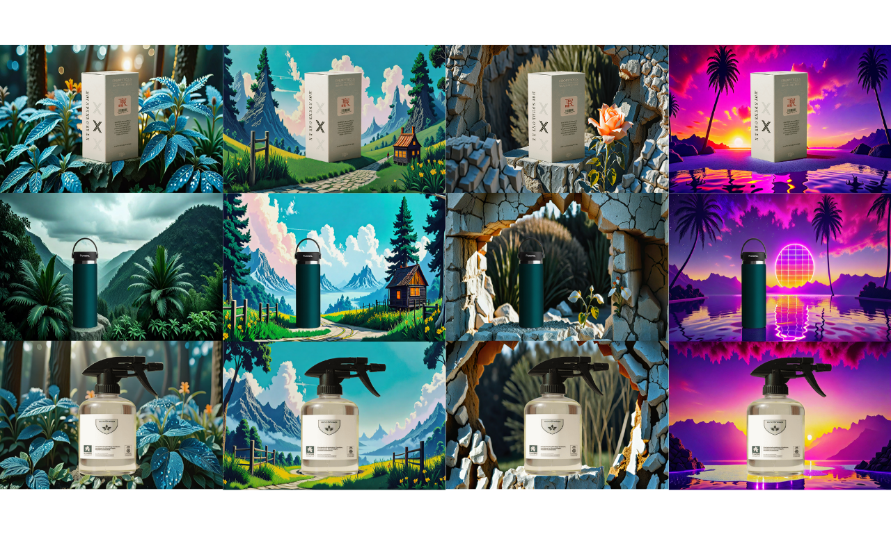
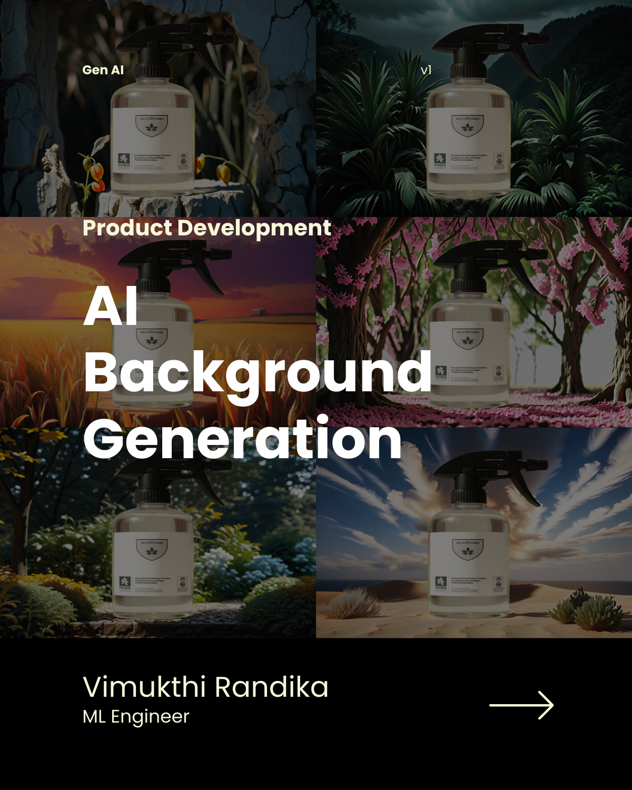
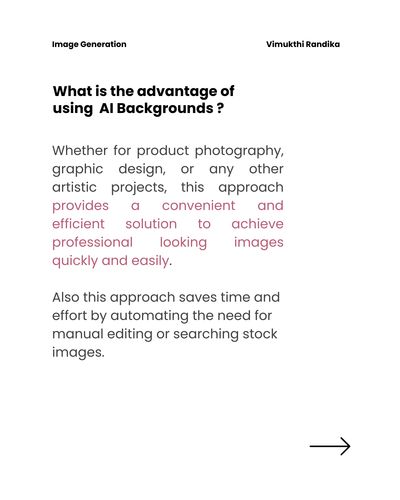
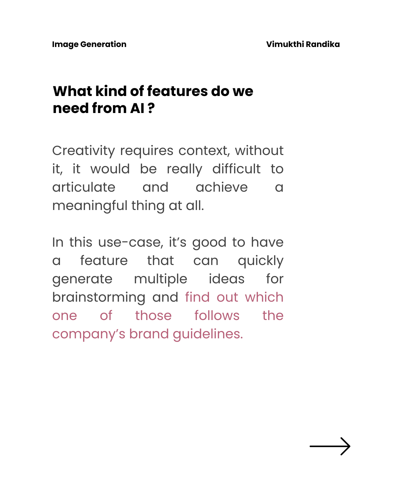
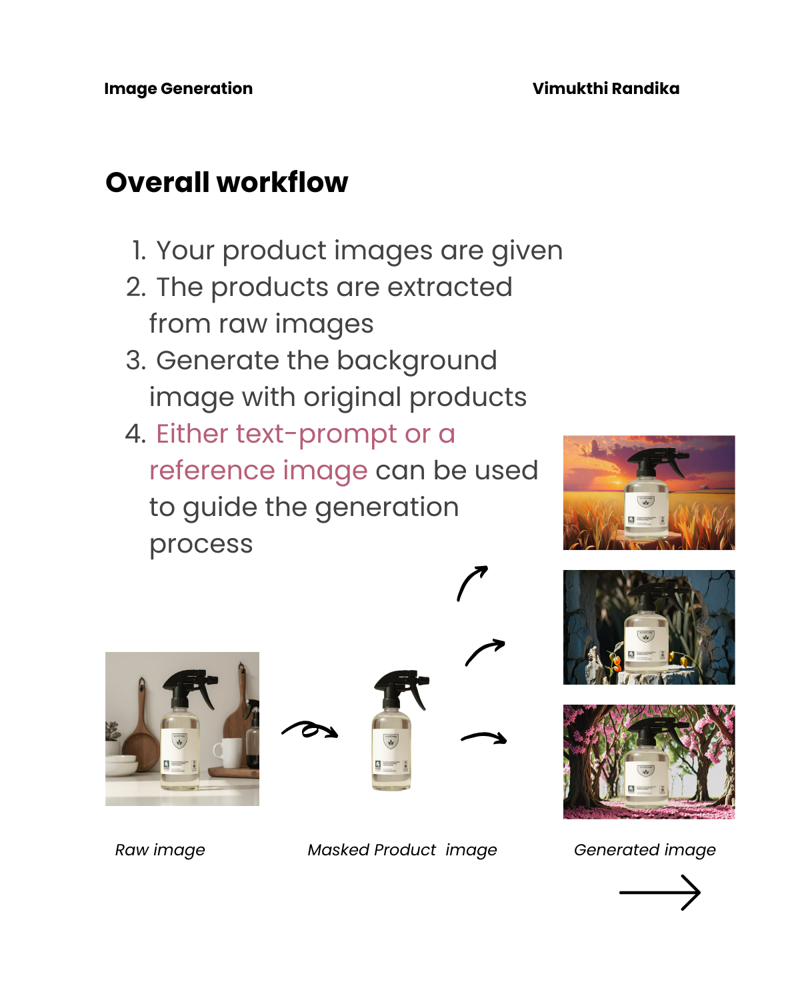
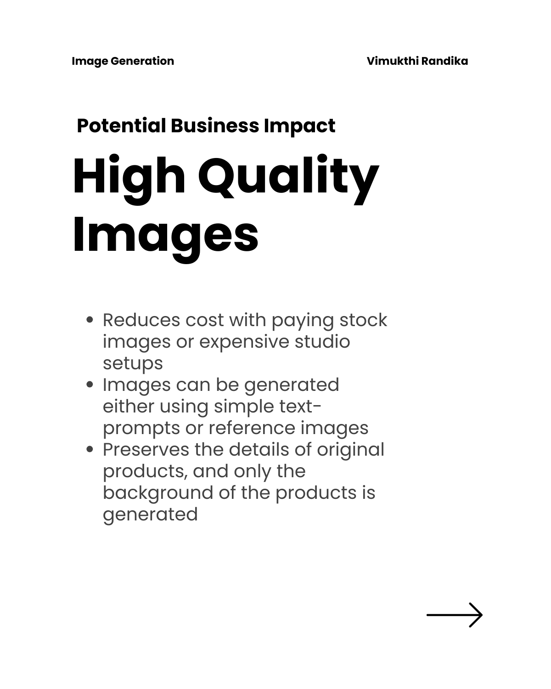
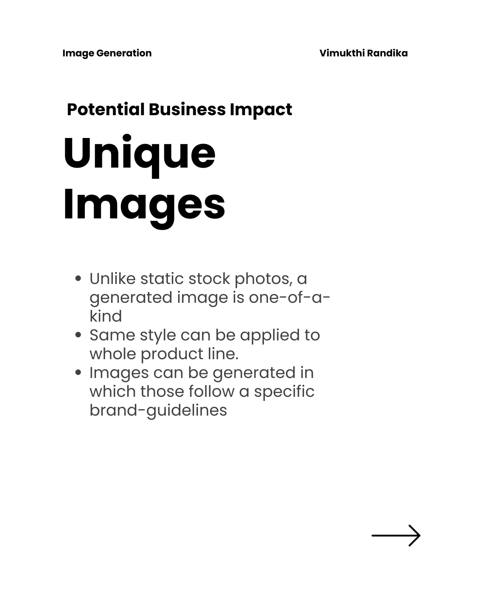
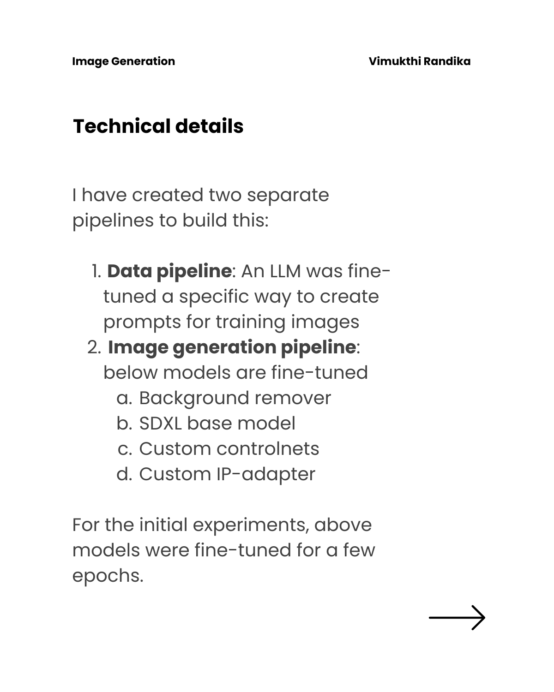
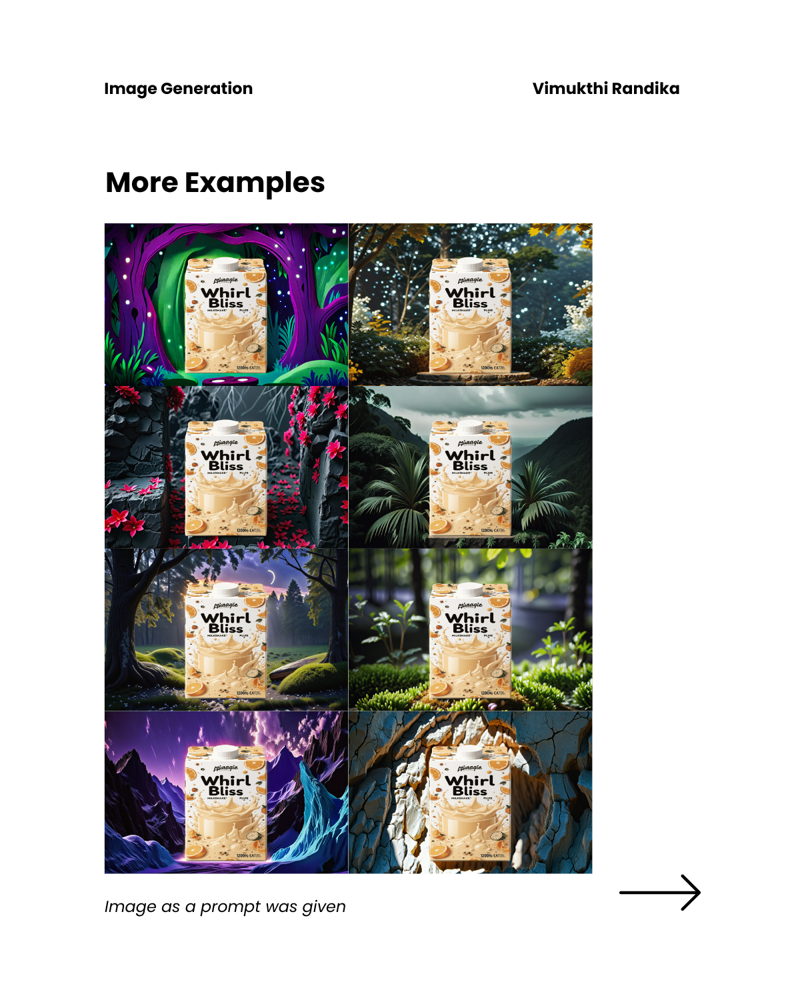
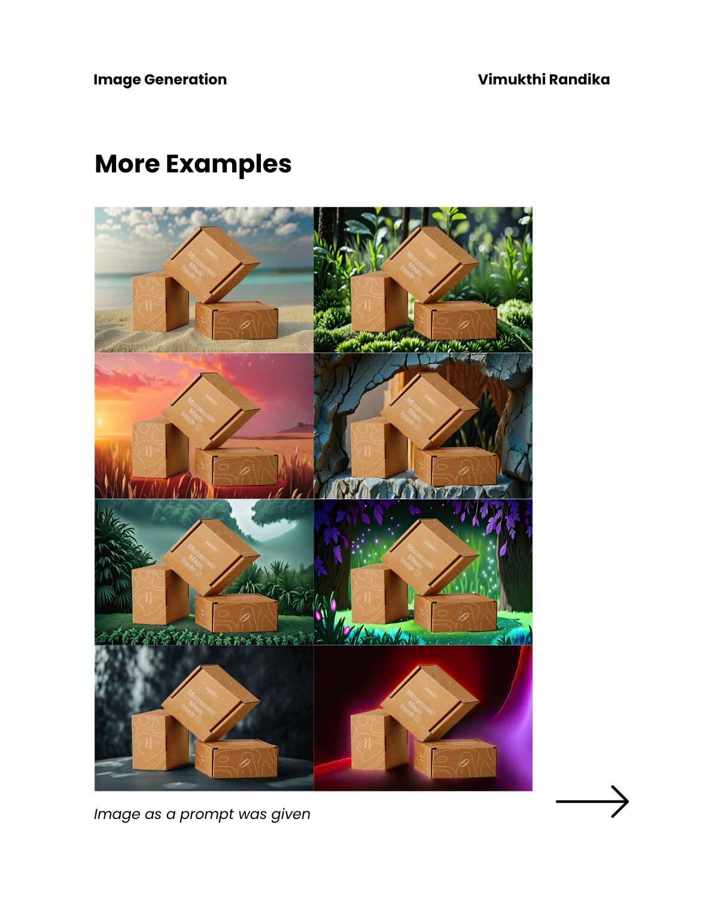

# AI Background Generation

Generate backgrounds( outpainting ) given foreground product objects. This can be useful feature in e-commerce platforms.

Check this for API design: [API design](https://github.com/VimukthiRandika1997/AI-development/tree/main/ai-background-generation)

Here is set of examples where same product is seamlessly placed on different backgrounds (image as a prompt is given).

  

## Intro

## Business Value

  
  

## Workflow

  

## Features

  
  

## Technical Details

  

## Examples

  
  

